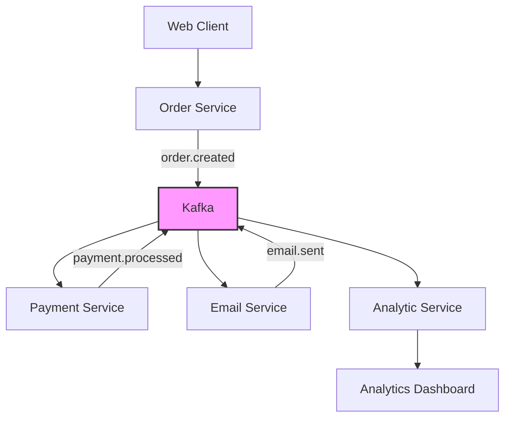

# 🚀 Kafka Microservices Orchestration Platform

A full-featured event-driven microservices platform demonstrating real-time data processing with Apache Kafka and Zookeeper.


## 📋 Table of Contents
- [Overview](#overview)
- [Architecture](#architecture)
- [Prerequisites](#prerequisites)
- [Quick Start](#quick-start)
- [Services](#services)
- [Kafka Management](#kafka-management)
- [API Endpoints](#api-endpoints)
- [Monitoring](#monitoring)
- [Development](#development)
- [Troubleshooting](#troubleshooting)

## 🎯 Overview

This project demonstrates a production-ready event-driven architecture using Apache Kafka as the message broker. It simulates an e-commerce platform where different services communicate asynchronously through Kafka topics, ensuring loose coupling and high scalability.

**Key Features:**
- 📊 Real-time order processing pipeline
- 💳 Simulated payment processing
- 📧 Automated email notifications
- 📈 Real-time analytics aggregation
- 🖥️ Interactive web dashboard
- 🔍 Kafka UI for cluster monitoring

## 🏗️ Architecture



**Technology Stack:**
- **Message Broker:** Apache Kafka with Zookeeper
- **Container Orchestration:** Docker Compose
- **Backend Services:** Node.js (ES Modules)
- **Frontend:** Modern JavaScript Framework
- **Monitoring:** Kafka UI (akhq)

## 📦 Prerequisites

Ensure you have the following installed:

- [Docker](https://docs.docker.com/get-docker/) (v20.10+)
- [Docker Compose](https://docs.docker.com/compose/install/) (v2.0+)
- [Node.js](https://nodejs.org/) (v18+)
- [npm](https://www.npmjs.com/) (v8+)

## 🚀 Quick Start

### 1. Clone and Navigate
```bash
git clone <repository-url>
cd Kafka-with-Zookeeper
```

### 2. Start Kafka Cluster
```bash
# Option 1: From project root
docker compose -f ./services/kafka/docker-compose.yml up -d

# Option 2: Navigate to kafka directory
cd services/kafka
docker compose up -d
```

### 3. Access Kafka UI
Once running, access the Kafka management interface:
- **URL:** http://localhost:8080
- **Features:** Topic management, message browsing, consumer group monitoring

### 4. Launch Web Dashboard
```bash
cd services/client
npm install
npm run dev
```
Access the dashboard at: http://localhost:3001

## 🔧 Services

### Payment Service
Handles payment processing and transaction validation.
```bash
cd services/payment-service
node --watch index.js
```

### Email Service
Manages email notifications and template rendering.
```bash
cd services/email-service
node --watch index.js
```

### Order Service
Core service for order creation and lifecycle management.
```bash
cd services/order-service
node --watch index.js
```

### Analytic Service
Processes streaming data for real-time analytics.
```bash
cd services/analytic-service
node --watch index.js
```

## 📊 Kafka Management

### Create Topics
Initialize Kafka topics for all services:
```bash
cd services/kafka

# Using npm script
npm run create

# Or directly with Node.js
node admin.js create
```

### Default Topics Created:
- `orders` - Order creation and updates
- `payments` - Payment processing events
- `emails` - Email notification queue
- `analytics` - Data aggregation stream
- `dead-letter-queue` - Failed message handling

### View Topics and Messages
1. Access Kafka UI at http://localhost:8080
2. Navigate to "Topics" section
3. Browse messages in real-time
4. Monitor consumer group progress

## 📈 Monitoring

### Kafka UI Dashboard
- **URL:** http://localhost:8080
- **Features:**
  - Real-time topic message browsing
  - Consumer group lag monitoring
  - Broker health status
  - Topic configuration management

## 🛠️ Development

### Project Structure
```
Kafka-with-Zookeeper/
├── services/
│   ├── kafka/              # Kafka & Zookeeper configuration
│   │   ├── docker-compose.yml
│   │   └── admin.js        # Topic management
│   ├── client/             # Web dashboard
│   ├── order-service/      # Order management
│   ├── payment-service/    # Payment processing
│   ├── email-service/      # Notifications
│   └── analytic-service/   # Real-time analytics
└── README.md
```

### Adding New Services
1. Create new service directory in `services/`
2. Implement Kafka consumer/producer logic
3. Update topic creation in `admin.js`
4. Add to documentation

### Environment Variables
Each service supports configuration via environment variables:
```bash
KAFKA_BROKER=localhost:9092
SERVICE_PORT=3000
LOG_LEVEL=info
```

## 🐛 Troubleshooting

### Common Issues

**1. Kafka containers not starting:**
```bash
# Check logs
docker compose -f services/kafka/docker-compose.yml logs

# Restart containers
docker compose -f services/kafka/docker-compose.yml restart
```

**2. Topics not created:**
```bash
# Ensure Kafka is running
docker ps | grep kafka

# Manually create topics
cd services/kafka
node admin.js create --force
```


This project is licensed under the MIT License - see the LICENSE file for details.

**Happy Event Streaming!** 🎉

*For questions or support, please open an issue in the GitHub repository.*